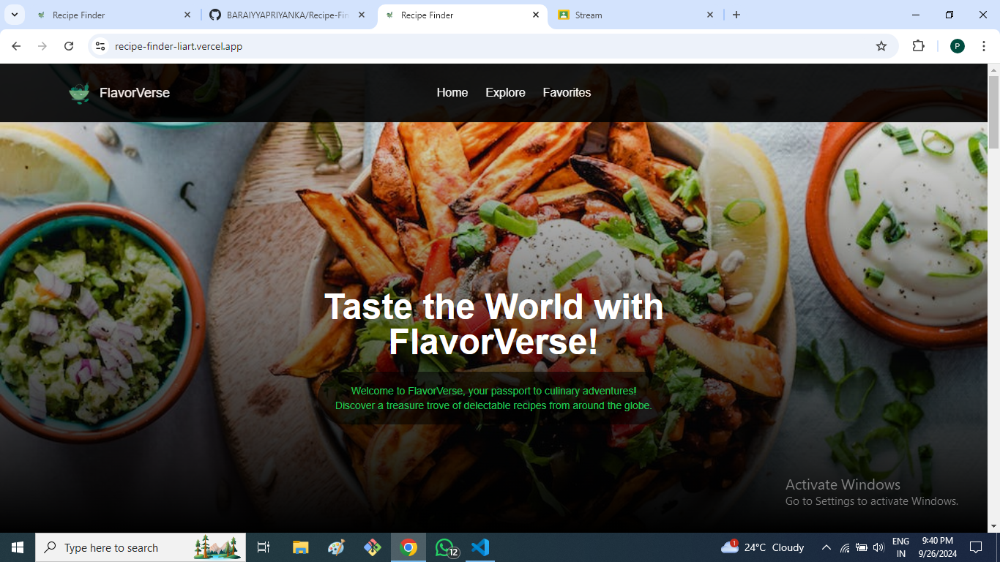
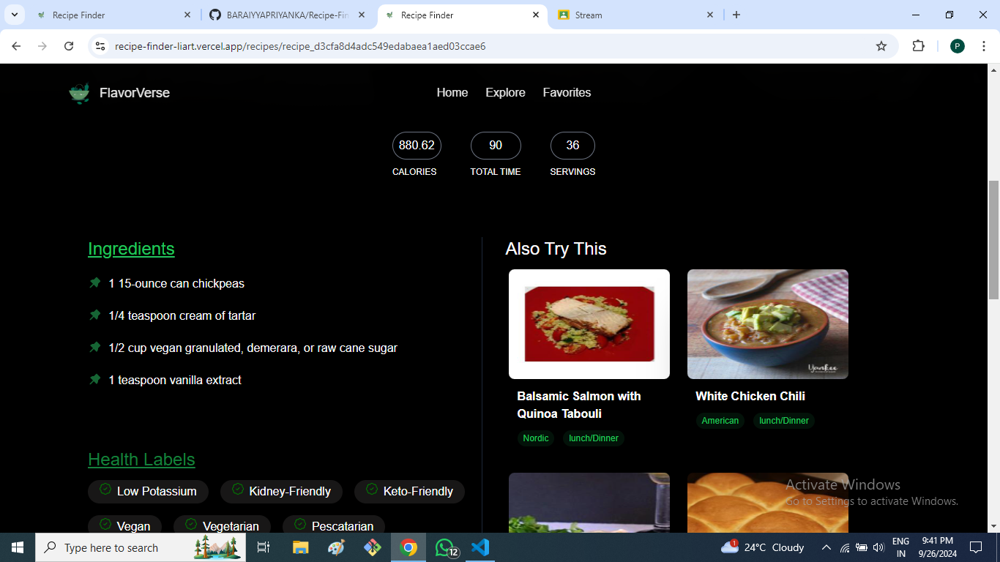

# Recipe Finder

 Recipe Finder is a web application that allows users to search for recipes based on ingredients. The app fetches data from the Edamam Recipe Search API and displays detailed recipe information along with health labels, ingredients, and related recommendations.

## Table of Contents

- Demo
- Features
- Technologies
- API Integration
- Components Overview
- Contributing
- License

## Demo
Hosted link(https://recipe-finder-liart.vercel.app/)

## Features
- Search for recipes by ingredients.
- View detailed information on selected recipes (calories, preparation time, servings, ingredients, etc.).
- Display health labels for each recipe.
- Suggest related recipes based on the current recipe.
- Responsive design using Tailwind CSS.

## Technologies
This project is built with the following technologies:

- React: Front-end JavaScript library for building user interfaces.
- React Router: For managing navigation and routing within the application.
- Vite: Lightning-fast development server and build tool.
- Tailwind CSS: Utility-first CSS framework for responsive design.
- React Icons: Icon library for React-based projects.
- ESLint: Code linting for maintaining code quality.

## Api Integration
The application uses the Edamam Recipe Search API to fetch recipes based on search queries.

## Components Overview
## Home Component
The Home component renders the main layout for the homepage. It includes:

- Header: Displays the app's title ("Taste the World with FlavorVerse!").
- Recipes Section: A section where the list of recipes is displayed.
## RecipeDetail Component
The RecipeDetail component is responsible for displaying the details of a single recipe and suggesting related recipes. It includes:

- Header: Displays the recipe's name and image.
- Details Section: Displays calories, total time, servings, ingredients, and health labels.
- Related Recipes: Suggests similar recipes based on the selected one.

## Contributing
Contributions are welcome! If you'd like to contribute to this project, feel free to fork the repository, create a new branch, and submit a pull request. Please make sure your code follows the project's linting and coding standards.

